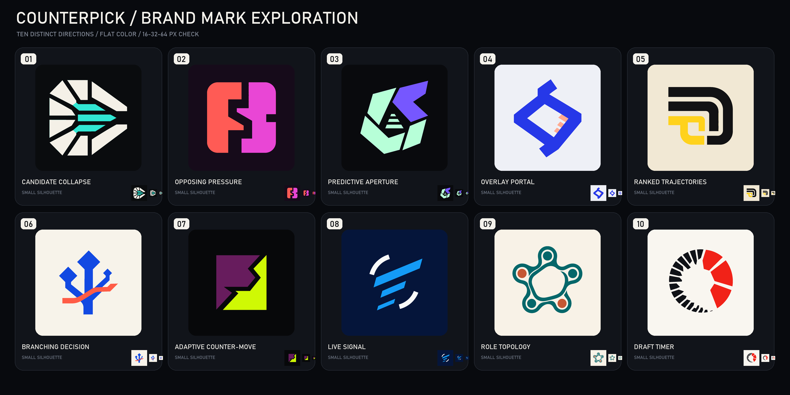

# Counterpick brand-mark exploration

Все десять направлений созданы как самостоятельные знаки, а не цветовые варианты одной формы. Финалы сохранены в PNG 1024×1024, сведены к flat-палитрам и дополнительно проверены в 64, 32 и 16 px.

## 01 — Candidate Collapse

- Файл: [`icon-01.png`](./icons/icon-01.png)
- Палитра: `#31E6D3`, `#F4F0E7`, `#0A0C0E`
- Идея: восемь внешних вариантов сходятся к трём ранжированным решениям в центре. Это наиболее прямое визуальное объяснение основного обещания Counterpick.
- Сильная сторона: уникальная радиальная композиция и очень явная связь с продуктовой механикой 8→3.
- Риск: на минимальном размере белые внешние сектора могут восприниматься как механическая турбина.

## 02 — Opposing Pressure

- Файл: [`icon-02.png`](./icons/icon-02.png)
- Палитра: `#FF5B55`, `#E946D5`, `#160B1A`
- Идея: две противодействующие массы образуют между собой тактический зигзагообразный зазор — action и counter-action.
- Сильная сторона: самый плотный знак с отличной читаемостью в Windows taskbar и tray.
- Риск: центральная negative space при беглом взгляде может напомнить абстрактную букву.

## 03 — Predictive Aperture

- Файл: [`icon-03.png`](./icons/icon-03.png)
- Палитра: `#7657FF`, `#B7FFD8`, `#090A0D`
- Идея: асимметричная система крупных граней открывает центральный predictive core, внутри которого остаются три результата.
- Сильная сторона: наиболее премиальный и технологичный силуэт без буквального изображения интерфейса.
- Риск: центральные три ступени становятся вторичным, а не главным элементом в 16 px.

## 04 — Overlay Portal

- Файл: [`icon-04.png`](./icons/icon-04.png)
- Палитра: `#2638E8`, `#FFAA91`, `#EEF0F6`
- Идея: непрерывная синяя лента формирует открытый портал, через который три рекомендации входят в игровое пространство.
- Сильная сторона: хорошо связывает бренд с механикой in-game overlay и даёт естественную траекторию для motion-анимации.
- Риск: без фирменной анимации часть аудитории может увидеть абстрактный tag или connector.

## 05 — Ranked Trajectories

- Файл: [`icon-05.png`](./icons/icon-05.png)
- Палитра: `#121214`, `#FFD21C`, `#F1E8D4`
- Идея: три вложенные траектории разной длины огибают единый decision core; жёлтая линия обозначает lead recommendation.
- Сильная сторона: спокойная, взрослая и очень универсальная система для интерфейса, сайта и desktop app.
- Риск: внешний контур может получить буквенную ассоциацию, если использовать знак без названия бренда.

## 06 — Branching Decision

- Файл: [`icon-06.png`](./icons/icon-06.png)
- Палитра: `#1249E2`, `#FF5C46`, `#F7F3EA`
- Идея: один исходный draft-state разветвляется в три ранжированных маршрута, а коралловая линия показывает выбранный counter-move.
- Сильная сторона: максимально понятно объясняет ветвление решения и легко анимируется от одного ствола к трём исходам.
- Риск: возможна ассоциация с деревом, USB или схемой маршрутизации.

## 07 — Adaptive Counter-Move

- Файл: [`icon-07.png`](./icons/icon-07.png)
- Палитра: `#671C5D`, `#CFF904`, `#07080A`
- Идея: две угловые силы сталкиваются, после чего lime-форма адаптивно меняет траекторию вокруг давления соперника.
- Сильная сторона: наиболее агрессивный, компактный и esports-ready силуэт среди десяти вариантов.
- Риск: острая negative space может считываться как молния или фрагмент буквы `B`.

## 08 — Live Signal

- Файл: [`icon-08.png`](./icons/icon-08.png)
- Палитра: `#149BF6`, `#F9FAF8`, `#05153A`
- Идея: три ранжированных live-потока проходят между двумя разорванными aperture-дугами; знак передаёт постоянное чтение драфта без radar/Wi-Fi-клише.
- Сильная сторона: лёгкий, быстрый и наиболее явно связанный с real-time поведением продукта.
- Риск: без анимации дуги могут выглядеть менее самостоятельными, чем центральные линии.

## 09 — Role Topology

- Файл: [`icon-09.png`](./icons/icon-09.png)
- Палитра: `#05676A`, `#C55734`, `#F8F2E7`
- Идея: пять role nodes соединены одной непрерывной топологией вокруг общего decision void.
- Сильная сторона: человеческая, менее агрессивная пластика и ясная связь с пятью Dota-позициями.
- Риск: наиболее сложный знак для 16 px; возможны ассоциации с молекулой, сетью или цветком.

## 10 — Draft Timer

- Файл: [`icon-10.png`](./icons/icon-10.png)
- Палитра: `#F12218`, `#101217`, `#F9F6F0`
- Идея: множество чёрных временных сегментов сжимаются до трёх красных surviving wedges до окончания draft timer.
- Сильная сторона: лучший потенциал для фирменной hero-анимации — весь знак может собираться из хаоса в три чётких решения.
- Риск: статичная версия может напомнить progress indicator или диаграмму.

## Рекомендация для shortlist

- `01` — лучший баланс продуктовой уникальности и понятной механики 8→3.
- `03` — самое премиальное технологичное направление.
- `07` — самый сильный standalone app icon на малом размере.
- `10` — самый высокий потенциал для единой motion-системы лендинга.

После выбора направления стоит сделать один точный refinement-pass: довести геометрию в SVG, проверить оптический баланс на 16/20/24/32/48/64/256 px и построить из формы motion grammar для лендинга и desktop overlay.

## Способ генерации

Использован встроенный ImageGen. Каждый концепт генерировался отдельным вызовом по общей спецификации `logo-brand`: один центрированный vector-friendly знак, flat 1–3 colors, сильный силуэт, без текста, mockup, 3D, gradients, Dota/Valve imagery, heroes, shields, gamepads, lightning bolts и generic AI sparkle. После визуального отбора палитры были локально нормализованы, а финалы приведены к единому размеру.
